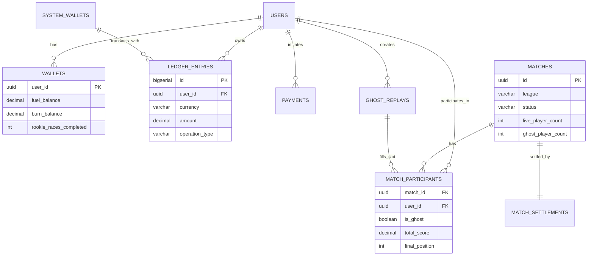

# Data Model: Nitro Drag Royale MVP

**Feature**: 001-nitro-drag-mvp  
**Date**: 2026-01-28  
**Status**: Phase 1 Design

## Overview

This document defines the complete data model for Nitro Drag Royale MVP. All entities are mapped to PostgreSQL schemas with explicit types, constraints, and relationships.

---

## 1. Core Entities

### 1.1 Users

Represents a player account.

**Table**: `users`

| Field | Type | Constraints | Description |
|-------|------|-------------|-------------|
| `id` | `UUID` | PRIMARY KEY | Internal user identifier |
| `telegram_id` | `BIGINT` | UNIQUE, NOT NULL | Telegram user ID |
| `telegram_username` | `VARCHAR(255)` | NULLABLE | Telegram username (may change) |
| `telegram_first_name` | `VARCHAR(255)` | NOT NULL | Telegram first name |
| `telegram_last_name` | `VARCHAR(255)` | NULLABLE | Telegram last name |
| `created_at` | `TIMESTAMP` | NOT NULL, DEFAULT NOW() | Account creation timestamp |
| `updated_at` | `TIMESTAMP` | NOT NULL, DEFAULT NOW() | Last update timestamp |

**Indexes**:
- `idx_users_telegram_id` on `telegram_id` (unique lookup)

**Validation Rules**:
- `telegram_id` must be positive integer
- `telegram_username` follows Telegram constraints (5-32 chars, alphanumeric + underscore)

---

### 1.2 Wallets

Represents a player's currency balances.

**Table**: `wallets`

| Field | Type | Constraints | Description |
|-------|------|-------------|-------------|
| `user_id` | `UUID` | PRIMARY KEY, REFERENCES users(id) | Owner user ID |
| `ton_balance` | `DECIMAL(16,2)` | NOT NULL, DEFAULT 0.00, CHECK >= 0 | TON balance (external currency) |
| `fuel_balance` | `DECIMAL(16,2)` | NOT NULL, DEFAULT 0.00, CHECK >= 0 | FUEL balance (hard currency) |
| `burn_balance` | `DECIMAL(16,2)` | NOT NULL, DEFAULT 0.00, CHECK >= 0 | BURN balance (meta currency, non-convertible) |
| `rookie_races_completed` | `INT` | NOT NULL, DEFAULT 0 | Count of Rookie races completed (max 3) |
| `ton_wallet_address` | `VARCHAR(66)` | NULLABLE | TON wallet address (if connected via TON Connect) |
| `created_at` | `TIMESTAMP` | NOT NULL, DEFAULT NOW() | Wallet creation timestamp |
| `updated_at` | `TIMESTAMP` | NOT NULL, DEFAULT NOW() | Last balance update timestamp |

**Constraints**:
- `CHECK (rookie_races_completed >= 0 AND rookie_races_completed <= 3)` — Rookie races capped at 3

**Validation Rules**:
- All balances must be non-negative (enforced via CHECK constraint)
- `ton_balance` and `fuel_balance` are convertible; `burn_balance` is **not** convertible to TON/FUEL

---

### 1.3 System Wallets

Special wallets representing house and rake pools.

**Table**: `system_wallets`

| Field | Type | Constraints | Description |
|-------|------|-------------|-------------|
| `wallet_name` | `VARCHAR(50)` | PRIMARY KEY | System wallet identifier |
| `fuel_balance` | `DECIMAL(16,2)` | NOT NULL, DEFAULT 0.00 | FUEL balance |
| `updated_at` | `TIMESTAMP` | NOT NULL, DEFAULT NOW() | Last update timestamp |

**Pre-seeded Rows**:
- `HOUSE_FUEL` — House wallet (Ghost buy-ins/prizes)
- `RAKE_FUEL` — Rake wallet (8% collected from all matches)

**Validation Rules**:
- `fuel_balance` can be negative temporarily during transactions (settlement logic ensures eventual consistency)

---

### 1.4 Ledger Entries

Immutable audit trail of all currency movements.

**Table**: `ledger_entries`

| Field | Type | Constraints | Description |
|-------|------|-------------|-------------|
| `id` | `BIGSERIAL` | PRIMARY KEY | Auto-increment entry ID |
| `user_id` | `UUID` | NULLABLE, REFERENCES users(id) | User involved (NULL for system wallets) |
| `system_wallet` | `VARCHAR(50)` | NULLABLE, REFERENCES system_wallets(wallet_name) | System wallet involved (NULL for user wallets) |
| `currency` | `VARCHAR(10)` | NOT NULL, CHECK IN ('TON', 'FUEL', 'BURN') | Currency type |
| `amount` | `DECIMAL(16,2)` | NOT NULL | Amount (positive = credit, negative = debit) |
| `operation_type` | `VARCHAR(50)` | NOT NULL | Operation type (see below) |
| `reference_id` | `UUID` | NULLABLE | Reference to related entity (match_id, payment_id, etc.) |
| `description` | `TEXT` | NULLABLE | Human-readable description |
| `created_at` | `TIMESTAMP` | NOT NULL, DEFAULT NOW() | Entry timestamp |

**Operation Types**:
- `DEPOSIT` — TON deposit from blockchain
- `WITHDRAWAL` — TON withdrawal to blockchain
- `MATCH_BUYIN` — Match buy-in deduction
- `MATCH_PRIZE` — Match prize payout
- `MATCH_RAKE` — Rake deduction
- `MATCH_BURN_REWARD` — BURN reward payout
- `INITIAL_BALANCE` — Initial balance grant (testing/promos)

**Indexes**:
- `idx_ledger_user_id` on `user_id` (balance calculation)
- `idx_ledger_reference_id` on `reference_id` (match ledger lookup)
- `idx_ledger_created_at` on `created_at` (time-based queries)

**Invariants**:
- For any `match_id` in `reference_id`, sum of all `amount` values MUST equal 0 (zero-sum economy)
- Each ledger entry is immutable (no UPDATE or DELETE operations)

---

### 1.5 Matches

Represents a single 10-player race session.

**Table**: `matches`

| Field | Type | Constraints | Description |
|-------|------|-------------|-------------|
| `id` | `UUID` | PRIMARY KEY | Match identifier |
| `league` | `VARCHAR(20)` | NOT NULL, CHECK IN ('ROOKIE', 'STREET', 'PRO', 'TOP_FUEL') | League tier |
| `status` | `VARCHAR(20)` | NOT NULL, CHECK IN ('FORMING', 'IN_PROGRESS', 'COMPLETED', 'ABORTED') | Match state |
| `live_player_count` | `INT` | NOT NULL, CHECK >= 1 AND <= 10 | Number of live players |
| `ghost_player_count` | `INT` | NOT NULL, CHECK >= 0 AND <= 9 | Number of Ghost players |
| `prize_pool` | `DECIMAL(16,2)` | NOT NULL | Total prize pool (before rake) |
| `rake_amount` | `DECIMAL(16,2)` | NOT NULL | 8% rake taken |
| `crash_seed` | `VARCHAR(128)` | NOT NULL | Cryptographic seed for provable fairness (one per heat, JSON array) |
| `crash_seed_hash` | `VARCHAR(64)` | NOT NULL | Pre-committed hash of crash_seed (revealed after match) |
| `started_at` | `TIMESTAMP` | NULLABLE | Match start timestamp |
| `completed_at` | `TIMESTAMP` | NULLABLE | Match completion timestamp |
| `created_at` | `TIMESTAMP` | NOT NULL, DEFAULT NOW() | Match creation timestamp |

**Constraints**:
- `CHECK (live_player_count + ghost_player_count = 10)` — Always exactly 10 players

**State Transitions**:
- `FORMING` → `IN_PROGRESS` (when countdown starts)
- `IN_PROGRESS` → `COMPLETED` (when Heat 3 ends and settlement applied)
- `IN_PROGRESS` → `ABORTED` (when graceful shutdown or timeout occurs)
- `FORMING` → `ABORTED` (when matchmaking fails or is cancelled)

**Indexes**:
- `idx_matches_status` on `status` (active match queries)
- `idx_matches_created_at` on `created_at` (match history)

---

### 1.6 Match Participants

Represents a player's participation in a match.

**Table**: `match_participants`

| Field | Type | Constraints | Description |
|-------|------|-------------|-------------|
| `match_id` | `UUID` | REFERENCES matches(id), NOT NULL | Match identifier |
| `user_id` | `UUID` | REFERENCES users(id), NULLABLE | User ID (NULL for Ghosts) |
| `is_ghost` | `BOOLEAN` | NOT NULL, DEFAULT FALSE | Whether this is a Ghost player |
| `ghost_replay_id` | `UUID` | NULLABLE, REFERENCES ghost_replays(id) | Ghost replay reference (if is_ghost = TRUE) |
| `player_display_name` | `VARCHAR(255)` | NOT NULL | Display name (for Ghosts, historical name) |
| `buyin_amount` | `DECIMAL(16,2)` | NOT NULL | Buy-in paid (FUEL) |
| `heat1_score` | `DECIMAL(8,2)` | NULLABLE | Heat 1 score (Speed locked) |
| `heat2_score` | `DECIMAL(8,2)` | NULLABLE | Heat 2 score |
| `heat3_score` | `DECIMAL(8,2)` | NULLABLE | Heat 3 score |
| `total_score` | `DECIMAL(8,2)` | NULLABLE | Sum of all heats |
| `final_position` | `INT` | NULLABLE, CHECK >= 1 AND <= 10 | Final position (1-10) |
| `prize_amount` | `DECIMAL(16,2)` | NOT NULL, DEFAULT 0.00 | Prize won (FUEL) |
| `burn_reward` | `DECIMAL(16,2)` | NOT NULL, DEFAULT 0.00 | BURN reward received |
| `created_at` | `TIMESTAMP` | NOT NULL, DEFAULT NOW() | Participant join timestamp |

**Primary Key**: `(match_id, user_id)` for live players; use `BIGSERIAL` surrogate key for Ghosts (since `user_id` is NULL)

**Constraints**:
- `CHECK ((is_ghost = TRUE AND user_id IS NULL AND ghost_replay_id IS NOT NULL) OR (is_ghost = FALSE AND user_id IS NOT NULL AND ghost_replay_id IS NULL))` — Ghost XOR live player
- `CHECK (total_score = COALESCE(heat1_score, 0) + COALESCE(heat2_score, 0) + COALESCE(heat3_score, 0))` — Computed total score invariant

**Indexes**:
- `idx_match_participants_user_id` on `user_id` (user match history)
- `idx_match_participants_match_id` on `match_id` (match participant lookup)

**Business Logic Notes**:
- **Tiebreaker**: When two or more players have identical `total_score`, the system uses Heat 3 score as first tiebreaker (higher wins), then Heat 2, then Heat 1. This is calculated at runtime in settlement logic; no dedicated tiebreaker column is stored.

---

### 1.7 Ghost Replays

Historical race performance data used to fill Ghost slots.

**Table**: `ghost_replays`

| Field | Type | Constraints | Description |
|-------|------|-------------|-------------|
| `id` | `UUID` | PRIMARY KEY | Ghost replay identifier |
| `source_match_id` | `UUID` | REFERENCES matches(id), NOT NULL | Original match where replay was recorded |
| `source_user_id` | `UUID` | REFERENCES users(id), NOT NULL | Original user who created replay |
| `league` | `VARCHAR(20)` | NOT NULL, CHECK IN ('ROOKIE', 'STREET', 'PRO', 'TOP_FUEL') | League tier (Ghosts only match same league) |
| `display_name` | `VARCHAR(255)` | NOT NULL | Display name (anonymized or historical) |
| `heat1_score` | `DECIMAL(8,2)` | NOT NULL | Recorded Heat 1 score |
| `heat2_score` | `DECIMAL(8,2)` | NOT NULL | Recorded Heat 2 score |
| `heat3_score` | `DECIMAL(8,2)` | NOT NULL | Recorded Heat 3 score |
| `total_score` | `DECIMAL(8,2)` | NOT NULL | Sum of heats |
| `behavioral_data` | `JSONB` | NOT NULL | Timing of score locks per heat (for realistic replay) |
| `created_at` | `TIMESTAMP` | NOT NULL, DEFAULT NOW() | Replay creation timestamp |

**Indexes**:
- `idx_ghost_replays_league` on `league` (Ghost selection by league)
- `idx_ghost_replays_total_score` on `total_score` (performance-based selection)

**Behavioral Data Schema** (JSONB):
```json
{
  "heat1_lock_time": 12.5,  // Seconds into heat when EARN POINTS pressed
  "heat2_lock_time": 8.3,
  "heat3_lock_time": 18.7
}
```

**Validation Rules**:
- Ghosts are selected from replays where `total_score` is representative (not all top performers or all crashes)
- Replay selection algorithm: stratified sampling by total_score percentiles (25th, 50th, 75th, 90th)

---

### 1.8 Match Settlements

Ensures idempotent settlement (applied exactly once per match).

**Table**: `match_settlements`

| Field | Type | Constraints | Description |
|-------|------|-------------|-------------|
| `match_id` | `UUID` | PRIMARY KEY, REFERENCES matches(id) | Match identifier |
| `settled_at` | `TIMESTAMP` | NOT NULL, DEFAULT NOW() | Settlement timestamp |

**Purpose**: Unique constraint on `match_id` ensures settlement ledger entries are applied exactly once.

---

### 1.9 Payments

TON deposit and withdrawal intents.

**Table**: `payments`

| Field | Type | Constraints | Description |
|-------|------|-------------|-------------|
| `id` | `UUID` | PRIMARY KEY | Payment identifier |
| `user_id` | `UUID` | REFERENCES users(id), NOT NULL | User initiating payment |
| `payment_type` | `VARCHAR(20)` | NOT NULL, CHECK IN ('DEPOSIT', 'WITHDRAWAL') | Payment direction |
| `status` | `VARCHAR(20)` | NOT NULL, CHECK IN ('PENDING', 'CONFIRMED', 'FAILED') | Payment status |
| `ton_amount` | `DECIMAL(16,2)` | NOT NULL, CHECK > 0 | TON amount |
| `fuel_amount` | `DECIMAL(16,2)` | NOT NULL, CHECK > 0 | Equivalent FUEL amount |
| `ton_tx_hash` | `VARCHAR(128)` | NULLABLE, UNIQUE | TON transaction hash (blockchain reference) |
| `client_request_id` | `UUID` | NOT NULL, UNIQUE | Client-provided idempotency key |
| `created_at` | `TIMESTAMP` | NOT NULL, DEFAULT NOW() | Payment creation timestamp |
| `updated_at` | `TIMESTAMP` | NOT NULL, DEFAULT NOW() | Last status update timestamp |

**Indexes**:
- `idx_payments_user_id` on `user_id` (user payment history)
- `idx_payments_ton_tx_hash` on `ton_tx_hash` (blockchain reconciliation)
- `idx_payments_status` on `status` (pending payment queries)

**State Transitions**:
- `PENDING` → `CONFIRMED` (blockchain confirms transaction)
- `PENDING` → `FAILED` (transaction rejected or timeout)

**Idempotency**:
- `client_request_id` ensures duplicate withdrawal requests are rejected
- `ton_tx_hash` ensures duplicate deposit credits are rejected

---

## 2. Relationships



---

## 3. Fixed-Point Decimal Rules

All monetary values use `DECIMAL(16,2)`:
- **Precision**: 16 total digits, 2 decimal places
- **Rounding**: Always **round down (floor)** using `Truncate(2)` in Go (`shopspring/decimal`)
- **Forbidden**: Floating point arithmetic in economy code paths

**Example**:
- `10.00 / 3 = 3.33` (not 3.3333...)
- Ledger sum for match: `(10 buy-ins * 10 players) - (8% rake) - (prizes to top 3) = 0.00`

---

## 4. Ledger Invariants

### Per-Match Invariant
For any `match_id`:
```sql
SELECT SUM(amount) FROM ledger_entries WHERE reference_id = '<match_id>' AND currency = 'FUEL';
-- MUST equal 0.00
```

### System Wallet Balance
```sql
SELECT fuel_balance FROM system_wallets WHERE wallet_name = 'HOUSE_FUEL';
-- Tracks Ghost buy-ins and prizes (can be negative temporarily, positive long-term)
```

### Rake Accumulation
```sql
SELECT SUM(amount) FROM ledger_entries WHERE operation_type = 'MATCH_RAKE' AND currency = 'FUEL';
-- Total rake collected (positive, monotonically increasing)
```

---

## 5. Indexes Summary

| Table | Index | Columns | Purpose |
|-------|-------|---------|---------|
| `users` | `idx_users_telegram_id` | `telegram_id` | Telegram auth lookup |
| `ledger_entries` | `idx_ledger_user_id` | `user_id` | Balance calculation |
| `ledger_entries` | `idx_ledger_reference_id` | `reference_id` | Match ledger lookup |
| `ledger_entries` | `idx_ledger_created_at` | `created_at` | Time-series queries |
| `matches` | `idx_matches_status` | `status` | Active match queries |
| `matches` | `idx_matches_created_at` | `created_at` | Match history |
| `match_participants` | `idx_match_participants_user_id` | `user_id` | User match history |
| `match_participants` | `idx_match_participants_match_id` | `match_id` | Participant lookup |
| `ghost_replays` | `idx_ghost_replays_league` | `league` | Ghost selection |
| `payments` | `idx_payments_user_id` | `user_id` | Payment history |
| `payments` | `idx_payments_ton_tx_hash` | `ton_tx_hash` | Blockchain reconciliation |

---

## 6. Migration Strategy

Migrations managed via `golang-migrate` with SQL up/down files:

```
backend/internal/storage/postgres/migrations/
├── 000001_create_users.up.sql
├── 000001_create_users.down.sql
├── 000002_create_wallets.up.sql
├── 000002_create_wallets.down.sql
├── 000003_create_system_wallets.up.sql
├── ...
```

**Rules**:
- Migrations are **additive-only** in MVP (no rewriting monetary history)
- Each migration is idempotent (safe to re-run)
- Financial tables (ledger, wallets) never have DELETE operations (audit trail)

---

## Phase 1 Data Model Summary

All entities defined with PostgreSQL schemas, relationships, constraints, and indexes. Ready for contract generation (Phase 1 contracts) and implementation (Phase 2 tasks).
